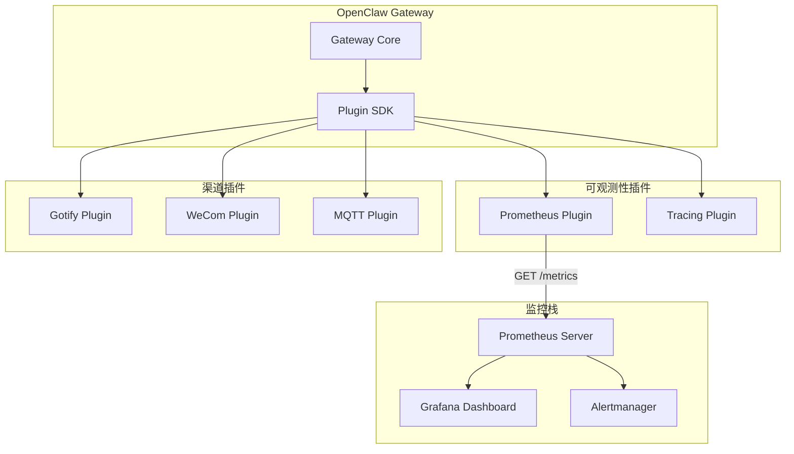
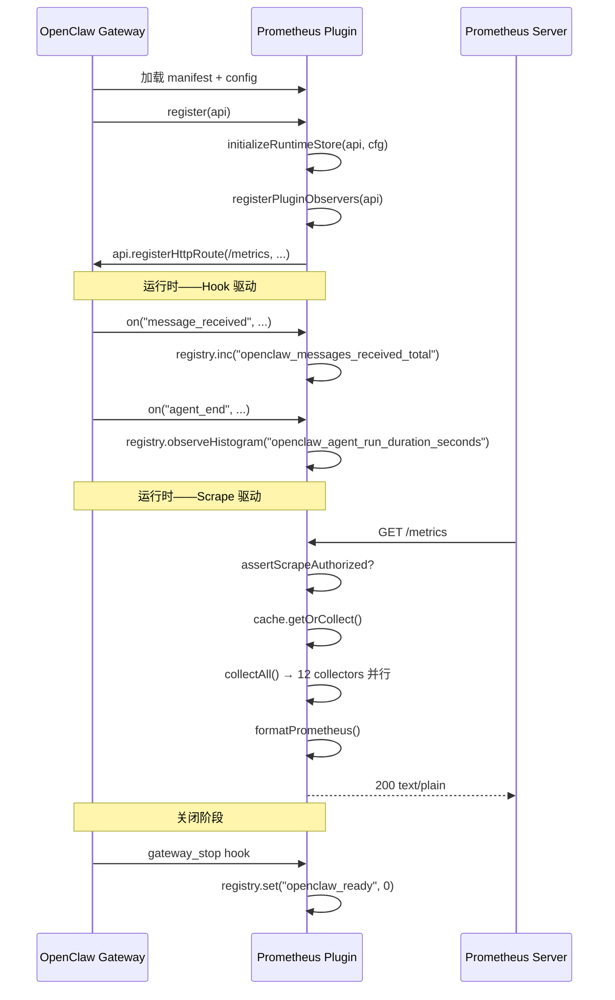

# OpenClaw-Prometheus 架构设计文档

> **OpenClaw-Prometheus = OpenClaw 生态的 Prometheus 指标导出插件。**  
> 它遵循 OpenClaw 插件规范与 `definePluginEntry` 入口模型，将 OpenClaw Gateway 的运行时状态、会话活动、模型消耗、渠道健康等核心指标以 Prometheus 标准格式导出，实现**全链路可观测性**。

[](#)
[](#)
[](#)

---

**文档约定**：本文以 OpenClaw 插件 SDK 为基线，定义 `openclaw-prometheus` 的架构设计、模块划分、数据流与实现落点。「插件」即指 `openclaw-prometheus`；默认运行环境为 Node.js / TypeScript，插件宿主为 OpenClaw Gateway。

**同步原则**：
- 与 OpenClaw 插件规范（`@openclaw/plugin-sdk`）保持同一套生命周期与能力注册模型；
- 仅使用文档化的 SDK 接口（`api.runtime.*`、Plugin Hooks、Runtime Events、Plugin-owned HTTP Routes），不依赖宿主私有源码和未文档化 Gateway 内部接口；
- 所有指标基于插件可以合法观测到的事实构建，确保跨版本兼容性。

---

## 目录

### Part I：定位与核心价值
- 1. 为什么需要 OpenClaw-Prometheus
- 2. 在 OpenClaw 插件生态中的位置
- 3. 应用场景
- 4. 三条硬约束与总体架构

### Part II：架构总览——三层指标模型
- 5. OpenClaw 插件生命周期回顾
- 6. 三层指标架构：Observer → Collector → Export
- 7. 核心工作流：Hook 采集、RPC 拉取、Scrape 导出
  - 7.5 SLI 衍生指标计算模型

### Part III：核心技术实现
- 8. 模块划分与目录结构
- 9. Observer 层：Hook 注册与实时计数（observer.ts）
- 10. MetricsRegistry：指标存储与高性能查询（metrics-registry.ts）
- 11. Collector 层：12 个采集器与 RPC 桥接
- 12. Export 层：HTTP 端点与格式化器
- 13. 配置解析与默认值（plugin-config.ts）
- 14. 采集缓存与 TTL 控制（collect-cache.ts）
- 15. Scrape 鉴权（scrape-auth.ts）
- 16. Gateway RPC 桥接（ws-bridge.ts）
- 17. 运行时状态管理（runtime-store.ts）
- 18. 入口与 HTTP 路由（index.ts）

### Part IV：OpenClaw 插件契约对齐
- 19. definePluginEntry 适配器映射
- 20. SDK 导入路径与注册模式
- 21. configSchema 配置校验

### Part V：部署与集成
- 22. 插件安装与配置
- 23. Prometheus 抓取配置
- 24. Grafana Dashboard 集成
- 25. 多实例部署与 Instance 标签

### Part VI：测试与验收
- 26. 单元测试策略
- 27. 集成测试：端到端 Scrape 流
- 28. 兼容性验证基线

### Part VII：附录
- 附录 A：指标域速查表
- 附录 B：配置示例
- 附录 C：术语表

---

# Part I：定位与核心价值

## 1. 为什么需要 OpenClaw-Prometheus

OpenClaw Gateway 作为 AI 网关，承载着多渠道消息路由、LLM 模型调度、Agent 生命周期管理等核心职责。然而，Gateway 本身不内置 Prometheus 指标导出能力——运维团队需要独立部署监控系统来观测 Gateway 的运行状态。

`openclaw-prometheus` 插件将 Prometheus 指标导出能力接入 OpenClaw，实现以下关键价值：

- **全链路可观测**：覆盖消息收发、Agent 运行、模型 Token 消耗、渠道连接状态、会话生命周期等全维度指标。
- **纯插件架构**：仅使用官方 SDK 暴露的稳定能力（Hooks、Runtime API、Events），不需要修改 OpenClaw 核心源码，确保跨版本兼容。
- **企业级运维取向**：参考 RabbitMQ Prometheus 实践，提供稳定的指标命名、分层导出（Prometheus text + JSON drill-down）、TLS 由 Gateway/反代终止、控制高基数标签使用。
- **SLI/SLO 就绪**：内置消息成功率、Agent 错误率、工具错误率、渠道健康率等 SLI 衍生指标，可直接用于 SLO 告警。
- **低开销采集**：TTL 缓存避免高频 Scrape 风暴，O(1) SLI 计算替代全量快照，预分配序列化减少 GC 压力。

### 1.1 三大非妥协目标

| 目标 | 强约束 | 插件体现 |
|------|--------|----------|
| **OpenClaw 插件契约兼容** | 仅使用 `definePluginEntry` + 文档化 SDK 接口 | `index.ts` 入口，`api.runtime.*`，Plugin Hooks，`api.registerHttpRoute` |
| **Prometheus 标准对齐** | 遵循 Prometheus 命名规范与 Exposition Format | `openclaw_{domain}_{entity}_{metric}_{suffix}` 命名，`text/plain; version=0.0.4` 输出 |
| **生产级可靠性** | 采集器失败不阻塞其他采集器，缓存降级可用 | `Promise.allSettled` 并行采集，`CollectCache` TTL 控制，`collector_success` 健康指标 |

### 1.2 非目标

- 不替代 Prometheus Server 或 Grafana 的功能；
- 不实现 Pushgateway 模式（仅支持 Pull/Scrape）；
- 不在插件内实现告警评估（告警规则由 Prometheus Alertmanager 承担）；
- 不实现自定义指标注册（所有指标由插件内部定义和管理）；
- 不实现 OpenClaw 配置变更推送（仅读取配置用于指标标签）。

## 2. 在 OpenClaw 插件生态中的位置

`openclaw-prometheus` 属于 **非渠道（Non-Channel）插件**，与 `openclaw-tracing`（链路追踪）处于同一扩展层，为 OpenClaw 提供可观测性能力。



**插件层级职责**：
- **上承 OpenClaw Gateway**：通过 Plugin Hooks 监听实时事件，通过 `api.runtime.*` 拉取状态快照；
- **下接 Prometheus 生态**：以标准 Prometheus Exposition Format 输出指标，供 Prometheus Server 定期 Scrape。

## 3. 应用场景

### 3.1 Gateway 运行状态监控

运维团队需要实时了解 OpenClaw Gateway 的运行状态——是否在线、运行时长、快照新鲜度等：

```
Prometheus Server ── GET /metrics ──▶ openclaw-prometheus
                                          │
                                          ├── openclaw_up = 1
                                          ├── openclaw_ready = 1
                                          ├── openclaw_plugin_uptime_seconds
                                          └── openclaw_runtime_snapshot_age_seconds
```

### 3.2 消息投递成功率 SLO

通过 SLI 衍生指标监控消息投递质量，设置 SLO 告警：

```promql
# 消息投递成功率
openclaw_sli_message_success_ratio

# SLO 错误预算
1 - openclaw_sli_message_success_ratio

# Burn Rate（1 小时错误率超过 SLO 容限的倍数）
rate(openclaw_sli_agent_error_ratio[1h]) / (1 - 0.999)
```

### 3.3 Agent 性能分析

通过 Histogram 指标分析 Agent 运行延迟分布，定位慢 Agent：

```promql
# P95 Agent 延迟，按 agent_id 分组
histogram_quantile(0.95,
  sum(rate(openclaw_agent_run_duration_seconds_bucket[5m])) by (le, agent_id)
)

# Top 5 最慢 Agent
topk(5,
  histogram_quantile(0.99,
    sum(rate(openclaw_agent_run_duration_seconds_bucket[5m])) by (le, agent_id)
  )
)
```

### 3.4 模型 Token 消耗与成本追踪

实时追踪各 Provider/Model 的 Token 消耗，结合 Usage RPC 聚合窗口计算成本：

```promql
# Token 吞吐量
rate(openclaw_model_llm_tokens_total[5m]) by (model)

# 日成本趋势
openclaw_usage_daily_cost_usd_total

# Provider 成本占比
openclaw_usage_provider_cost_usd_total
```

### 3.5 渠道健康监控

监控各渠道的连接状态与消息活跃度，及时发现断连：

```promql
# 渠道活跃度（秒）
time() - openclaw_channel_last_event_timestamp_seconds

# 断开渠道数
sum(openclaw_channel_linked == 0)
```

### 3.6 模型认证过期预警

监控 API Key 的过期状态，提前预警即将过期的 Provider：

```promql
# 认证即将过期（<24h）
openclaw_model_auth_provider_remaining_seconds < 86400
```

## 4. 三条硬约束与总体架构

### 4.1 硬约束 A：仅使用文档化 SDK 接口

| SDK 接口 | 用途 | 插件落点 |
|----------|------|----------|
| `api.runtime.modelAuth` | Provider 认证状态探测 | `observer.ts:refreshRuntimeSnapshots` |
| `api.runtime.channel.activity` | 渠道活跃度查询 | `observer.ts:refreshChannelActivityGauges` |
| `api.runtime.state` | 状态目录解析 | `observer.ts:refreshHousekeepingMetrics` |
| `api.runtime.events.onAgentEvent` | Agent 运行事件流 | `observer.ts:registerRuntimeEventListeners` |
| `api.runtime.events.onSessionTranscriptUpdate` | 会话 Transcript 更新 | `observer.ts:registerRuntimeEventListeners` |
| Plugin Hooks（28 个） | 实时事件计数 | `observer.ts:registerPluginObservers` |
| `api.registerHttpRoute` | HTTP 端点注册 | `index.ts:registerMetricsRoutes` |
| `GatewayClient` (RPC) | Gateway 内部状态拉取 | `ws-bridge.ts:rpcCall` |

### 4.2 硬约束 B：Prometheus 标准对齐

| Prometheus 规范 | 插件体现 |
|----------------|----------|
| 命名规范 `openclaw_{domain}_{entity}_{metric}_{suffix}` | 9 个指标域，~160 个指标 |
| Counter `_total` 后缀 | 所有 counter 类型指标 |
| Histogram `_bucket/_sum/_count` | Agent/Tool/HTTP 延迟分布 |
| Exposition Format `text/plain; version=0.0.4` | `formatters/prometheus.ts` |
| 低基数标签 | `channel`、`provider`、`model`、`agent_id`、`tool` |
| `+Inf` bucket | Histogram 必含 |

### 4.3 硬约束 C：生产级可靠性

- 采集器失败不阻塞其他采集器（`Promise.allSettled` 并行）；
- 缓存降级可用（`CollectCache` TTL 控制，避免 Scrape 风暴）；
- 每个采集器独立健康指标（`openclaw_metrics_collector_success`）；
- Scrape 鉴权可选（Bearer Token，环境变量优先）；
- 插件加载失败不影响 Gateway 运行。

---

# Part II：架构总览——三层指标模型

## 5. OpenClaw 插件生命周期回顾

OpenClaw 的非渠道插件遵循以下生命周期：



## 6. 三层指标架构：Observer → Collector → Export

| 层次 | 职责 | 实现组件 |
|------|------|----------|
| **Observer 层** | 监听 Plugin SDK hooks 和 Runtime Events，将事件转为 Prometheus 计数器/仪表盘 | `observer.ts` |
| **Collector 层** | 在 Scrape 请求到达时，按策略拉取/聚合指标（RPC pull + Hook snapshot + Node.js） | `collectors/*.ts`（12 个） |
| **Export 层** | 将采集结果格式化为 Prometheus text / JSON，通过 HTTP 端点暴露 | `formatters/prometheus.ts` + `formatters/json.ts` + `index.ts` |

```
┌─────────────────────────────────────────────────────────────────────┐
│                        OpenClaw Gateway                             │
│                                                                     │
│  ┌─────────────┐  ┌─────────────┐  ┌──────────────┐               │
│  │ Plugin SDK   │  │ Runtime API │  │ Plugin Hooks │               │
│  │  Events API  │  │ (RPC)       │  │ (实时回调)    │               │
│  └──────┬───────┘  └──────┬──────┘  └──────┬───────┘               │
│         │                 │                │                        │
│         ▼                 ▼                ▼                        │
│  ┌──────────────────────────────────────────────────────────────┐  │
│  │              openclaw-prometheus Plugin                       │  │
│  │                                                              │  │
│  │  ┌─────────────────────────────────────────────────────────┐ │  │
│  │  │                 Observer Layer                          │ │  │
│  │  │  (28 hooks → MetricsRegistry, 实时计数)                  │ │  │
│  │  └────────────────────────┬────────────────────────────────┘ │  │
│  │                           │                                  │  │
│  │  ┌────────────────────────┴────────────────────────────────┐ │  │
│  │  │              Collector Layer                            │ │  │
│  │  │  12 collectors (RPC pull + Hook snapshot + Node.js)     │ │  │
│  │  └────────────────────────┬────────────────────────────────┘ │  │
│  │                           │                                  │  │
│  │  ┌────────────────────────┴────────────────────────────────┐ │  │
│  │  │              Export Layer                               │ │  │
│  │  │  5 HTTP routes → Prometheus text / JSON / Health / Debug│ │  │
│  │  └─────────────────────────────────────────────────────────┘ │  │
│  └──────────────────────────────────────────────────────────────┘  │
│         │                                                           │
└─────────┼───────────────────────────────────────────────────────────┘
          │ HTTP scrape
          ▼
   ┌──────────────┐    ┌──────────────┐
   │  Prometheus   │    │    Grafana    │
   │  Server       │───▶│  Dashboard   │
   └──────────────┘    └──────────────┘
```

## 7. 核心工作流

### 7.1 Hook 驱动实时计数流（Observer 层）

1. OpenClaw Gateway 触发 Plugin Hook（如 `message_received`、`agent_end`）；
2. `observer.ts` 中注册的回调函数被调用；
3. 回调从 `getRuntimeStore()` 获取 `registry`；
4. 调用 `registry.inc()` / `registry.set()` / `registry.observeHistogram()` 更新指标；
5. 指标值存储在 `MetricsRegistry` 的内存 Map 中，等待下次 Scrape 读取。

**Hook → 指标映射**：

```
Plugin Hooks (28)                    MetricsRegistry (内存)
─────────────────                   ─────────────────────

message_received ─────┐
message_sent ─────────┤▶ openclaw_messages_received/sent_total
                      │  openclaw_channel_last_event_timestamp_seconds
                      │  openclaw_channel_failures_total

session_start ────────┤▶ openclaw_sessions_started/ended_total
session_end ──────────┤  openclaw_sessions_active_estimated

llm_output ───────────┤▶ openclaw_usage_tokens_input/output/cache_*
llm_input ────────────┤  openclaw_llm_input_images_total

before_tool_call ─────┤▶ openclaw_tool_calls_total / tool_call_failures_total
after_tool_call ──────┤  openclaw_tool_call_duration_seconds (histogram)

before_agent_start ───┤▶ openclaw_agent_runs_started/total
agent_end ────────────┤  openclaw_agent_run_duration_seconds (histogram)

before_compaction ────┤▶ openclaw_session_compaction_events_total
after_compaction ─────┘  openclaw_session_compaction_messages_compacted_total

gateway_start/stop ───▶ openclaw_ready
subagent_ended ───────▶ openclaw_subagent_ended_total
before_reset ─────────▶ openclaw_session_reset_requests_total
```

### 7.2 RPC 拉取聚合流（Collector 层）

1. Prometheus Server 发起 `GET /metrics` Scrape 请求；
2. `CollectCache.getOrCollect()` 检查缓存是否有效；
3. 缓存过期或首次请求时，调用 `collectAll()`；
4. 12 个 Collector 并行执行（`Promise.allSettled`）；
5. 每个 Collector 通过 `ws-bridge.ts` 的 `rpcCall()` 调用 Gateway RPC 方法；
6. RPC 响应被解析为 `MetricSample[]`；
7. 所有 Collector 的结果合并、去重、追加元指标；
8. 结果缓存到 `CollectCache`，返回给 Export 层。

**Collector → RPC 映射**：

```
Collector                    RPC Method
──────────                   ──────────

PluginRuntimeCollector       (内部: refreshRuntimeSnapshots + SLI)
HealthCollector              health
ChannelsCollector            channels.status
SessionsCollector            sessions.list
ModelsCollector              models.list
ModelAuthCollector           modelAuth.status
NodesCollector               nodes.list
SkillsCollector              skills.list
CronCollector                cron.status
PresenceCollector            presence.list
UsageCollector               sessions.usage
RuntimeCollector             (Node.js process metrics)
```

### 7.3 Scrape 导出流（Export 层）

1. HTTP 请求到达 `metricsHandler`；
2. `assertScrapeAuthorized()` 校验 Bearer Token（如启用）；
3. `cache.getOrCollect()` 获取采集结果；
4. `appendMetaSamples()` 追加 `build_info` 和 `scrape_duration`；
5. `formatPrometheus()` 序列化为 Prometheus text format；
6. 响应 `200 text/plain; version=0.0.4; charset=utf-8`。

### 7.4 JSON Drill-Down 流

1. HTTP 请求到达 `/metrics/per-object` 或 `/metrics/detailed?family=`；
2. 同样经过鉴权和缓存采集；
3. `formatJson()` 序列化为结构化 JSON（含 diagnostics 和 meta）；
4. `/metrics/detailed` 支持 `?family=` 前缀过滤，减少传输量。

### 7.5 SLI 衍生指标计算模型

SLI 指标由 `refreshSliMetrics()` 在每次 `PluginRuntimeCollector.collect()` 时周期计算，而非实时更新：

| SLI 指标 | 计算公式 | 数据来源 |
|----------|----------|----------|
| `openclaw_sli_message_success_ratio` | `sent_ok / (sent_ok + sent_error)` | `openclaw_messages_sent_total{result}` |
| `openclaw_sli_agent_error_ratio` | `agent_failed / agent_started` | `openclaw_agent_runs_total{result=error}` / `openclaw_agent_runs_started_total` |
| `openclaw_sli_tool_error_ratio` | `tool_failures / tool_total` | `openclaw_tool_call_failures_total` / `openclaw_tool_calls_total` |
| `openclaw_sli_channel_health_ratio` | `channel_linked / channel_total` | RPC `openclaw_channel_linked_total` / `openclaw_channel_total` |

**性能优化**：
- 使用 `registry.getSampleValue()` O(1) 直查替代全量快照；
- 使用 `registry.getSamplesByName()` 批量查询同名样本；
- HTTP 延迟 P95/P99 使用环形缓冲区（1000 样本）计算。

---

# Part III：核心技术实现

## 8. 模块划分与目录结构

```
openclaw-prometheus/
├── src/
│   ├── index.ts                # 插件入口，definePluginEntry + HTTP 路由注册
│   ├── observer.ts             # Hook 注册 + SLI 计算 + 快照刷新
│   ├── types.ts                # TypeScript 类型定义（Gateway RPC 响应、指标类型）
│   ├── metrics-registry.ts     # 指标存储 + 快照缓存 + O(1) 查询
│   ├── plugin-config.ts        # 配置解析 + 默认值 + 环境变量
│   ├── collect-cache.ts        # TTL 采集缓存
│   ├── scrape-auth.ts          # Bearer 鉴权
│   ├── ws-bridge.ts            # Gateway RPC 桥接（GatewayClient）
│   ├── runtime-store.ts        # 全局状态 + RPC 缓存
│   ├── version.ts              # 版本号
│   ├── openclaw-sdk.d.ts       # OpenClaw SDK 类型声明（补丁）
│   ├── collectors/             # 12 个采集器
│   │   ├── plugin-runtime.ts   # 核心：编排 snapshot + SLI + housekeeping
│   │   ├── health.ts           # Gateway health RPC
│   │   ├── channels.ts         # channels.status RPC
│   │   ├── sessions.ts         # sessions.list RPC
│   │   ├── models.ts           # models.list RPC
│   │   ├── model-auth.ts       # modelAuth.* RPC (probe + expiry)
│   │   ├── nodes.ts            # nodes.listNodes RPC
│   │   ├── skills.ts           # skills.listSkills RPC
│   │   ├── cron.ts             # cron.listJobs RPC
│   │   ├── presence.ts         # presence.listOnline RPC
│   │   ├── usage.ts            # sessions.usage RPC (聚合窗口)
│   │   └── runtime.ts          # Node.js 进程指标（可选）
│   └── formatters/             # 格式化器
│       ├── prometheus.ts       # Prometheus text 序列化（预分配 + 索引分桶）
│       └── json.ts             # JSON 序列化（per-object + diagnostics）
├── grafana/                    # Grafana Dashboard JSON
│   ├── cluster/                # 集群版 Dashboard
│   └── simple-test.json        # 简单测试 Dashboard
├── config/                     # Prometheus 配置示例
│   ├── local-prometheus.yml
│   └── prometheus.example.yaml
├── deploy/                     # 部署配置
│   ├── grafana/provisioning/
│   ├── loki/
│   └── prometheus/
├── alerts/                     # 告警规则
│   └── prometheus.yml
├── scripts/                    # 测试脚本
│   └── test-metrics-client.ts
├── docs/                       # 文档
├── .github/workflows/          # CI + Release
├── package.json / tsconfig.json / vitest.config.ts / tsup.config.ts
└── openclaw.plugin.json        # 插件清单（manifest）
```

**模块职责速查**：

| 文件 | 核心导出 | 职责 |
|------|---------|------|
| `index.ts` | `default export` (definePluginEntry) | 插件入口，注册 HTTP 路由，编排采集 |
| `observer.ts` | `registerPluginObservers`, `refreshRuntimeSnapshots`, `refreshSliMetrics` | Hook 注册 + 快照刷新 + SLI 计算 |
| `types.ts` | 15+ 接口/类型 | Gateway RPC 响应类型、指标类型定义 |
| `metrics-registry.ts` | `MetricsRegistry` class | 指标存储 + 快照缓存 + O(1) 查询 |
| `plugin-config.ts` | `resolvePrometheusConfig` | 配置解析 + 默认值 + 环境变量 |
| `collect-cache.ts` | `CollectCache` class | TTL 采集缓存 |
| `scrape-auth.ts` | `assertScrapeAuthorized` | Bearer 鉴权校验 |
| `ws-bridge.ts` | `rpcCall`, `rpcBatch` | Gateway RPC 桥接 |
| `runtime-store.ts` | `initializeRuntimeStore`, `getRuntimeStore` | 全局状态管理 |

## 9. Observer 层：Hook 注册与实时计数（observer.ts）

`observer.ts` 是插件与 OpenClaw Gateway 事件系统的桥梁，负责将 28 个 Plugin Hooks 和 2 个 Runtime Events 转化为 Prometheus 指标。

### 9.1 Hook 分组注册

```typescript
export function registerPluginObservers(api: OpenClawPluginApi): void {
  registerLifecycleHooks(api);       // gateway_start/stop, session_start/end
  registerMessageHooks(api);         // message_received/sent
  registerToolHooks(api);            // before/after_tool_call
  registerAgentHooks(api);           // before_agent_start, agent_end, llm_output
  registerRuntimeEventListeners(api); // onAgentEvent, onSessionTranscriptUpdate
  registerSupplementaryPluginHooks(api); // 其余 20+ hooks
}
```

### 9.2 Runtime Snapshot 刷新

`refreshRuntimeSnapshots(force?)` 定期刷新 Provider 认证状态：

1. 检查距上次刷新是否超过 `snapshotIntervalMs`（默认 30s）；
2. 对 `monitoredProviders` 中的每个 Provider 调用 `api.runtime.modelAuth.resolveApiKeyForProvider()`；
3. 将结果写入 `openclaw_model_auth_provider_status`（one-hot 编码）和 `openclaw_model_auth_provider_info`；
4. 更新 `openclaw_runtime_snapshot_age_seconds` 和 `openclaw_runtime_snapshot_refresh_timestamp_seconds`。

### 9.3 SLI 衍生指标计算

`refreshSliMetrics()` 使用 `registry.getSampleValue()` O(1) 直查计算 4 个 SLI 指标：

```typescript
export function refreshSliMetrics(): void {
  const msgOk = sumSamplesByLabel(registry.getSamplesByName("openclaw_messages_sent_total"), "result", "ok");
  const msgErr = sumSamplesByLabel(registry.getSamplesByName("openclaw_messages_sent_total"), "result", "error");
  registry.set("openclaw_sli_message_success_ratio", msgTotal > 0 ? msgOk / msgTotal : 1, { ... });
  // ... 同理计算 agent_error_ratio, tool_error_ratio, channel_health_ratio
}
```

### 9.4 HTTP 延迟环形缓冲区

HTTP 请求延迟使用固定大小（1000）的环形缓冲区，计算 P95/P99：

```typescript
const HTTP_LATENCY_SAMPLES: number[] = [];
const HTTP_LATENCY_MAX_SAMPLES = 1000;

export function recordHttpLatency(seconds: number): void {
  HTTP_LATENCY_SAMPLES.push(seconds);
  if (HTTP_LATENCY_SAMPLES.length > HTTP_LATENCY_MAX_SAMPLES) {
    HTTP_LATENCY_SAMPLES.shift();
  }
}
```

## 10. MetricsRegistry：指标存储与高性能查询（metrics-registry.ts）

`MetricsRegistry` 是插件的核心数据结构，提供指标定义管理、样本存储和高效查询。

### 10.1 数据结构

```typescript
class MetricsRegistry {
  private readonly definitions = new Map<string, MetricDefinition>();  // name → 定义
  private readonly samples = new Map<string, MetricSample>();          // sampleKey → 样本
  private _defCache: MetricDefinition[] | null = null;                 // 定义快照缓存
  private _sampleCache: MetricSample[] | null = null;                  // 样本快照缓存
}
```

### 10.2 高性能 sampleKey

使用 NUL 分隔替代 `JSON.stringify`，减少 GC 压力：

```typescript
function sampleKey(name: string, labels: LabelValues | undefined): string {
  if (!labels || Object.keys(labels).length === 0) return name;
  const keys = Object.keys(labels).sort();
  let key = name;
  for (let i = 0; i < keys.length; i++) {
    key += "\0" + keys[i] + "=" + labels[keys[i]];
  }
  return key;
}
```

### 10.3 操作方法

| 方法 | 类型 | 说明 |
|------|------|------|
| `set(name, value, opts)` | gauge | 设置绝对值 |
| `inc(name, by, opts)` | counter | 递增 |
| `dec(name, by, opts)` | gauge | 递减（不低于 0） |
| `observeHistogram(prefix, seconds, opts)` | histogram | 观察 + 更新 `_bucket/_sum/_count` |
| `observeSummary(prefix, seconds, opts)` | summary | 观察 + 更新 `_count/_sum` |
| `setOneHotStatus(name, current, statuses, opts)` | gauge | One-hot 编码状态 |
| `getSampleValue(name, labels?)` | 查询 | O(1) 直查 |
| `getSamplesByName(name)` | 查询 | 批量查询同名样本 |
| `snapshotDefinitions()` | 快照 | 带缓存的定义列表 |
| `snapshotSamples()` | 快照 | 带缓存的样本列表 |

### 10.4 缓存失效策略

- 任何 `set/inc/dec/observeHistogram/observeSummary` 操作都会调用 `invalidateCache()`；
- `snapshotDefinitions()` 和 `snapshotSamples()` 在首次调用后缓存结果，直到下次失效；
- `define()` 方法增加相等性检查：如果 help/type/labels 未变则跳过，减少无效失效。

### 10.5 Histogram Buckets

默认 16 档：`[0.001, 0.005, 0.01, 0.025, 0.05, 0.1, 0.25, 0.5, 1, 2.5, 5, 10, 30, 60, 120, 300]`，覆盖 1ms 到 5 分钟的延迟范围。

## 11. Collector 层：12 个采集器与 RPC 桥接

### 11.1 采集器接口

```typescript
interface MetricCollector {
  name: string;                              // 采集器名称
  definitions: MetricDefinition[];           // 指标定义列表
  collect(): Promise<MetricSample[]>;        // 执行采集
}
```

### 11.2 采集器列表

| 采集器 | name | 数据来源 | 核心指标 |
|--------|------|----------|----------|
| `PluginRuntimeCollector` | `plugin-runtime` | Hook snapshot + SLI + housekeeping | `openclaw_up`, `openclaw_ready`, `openclaw_sli_*` |
| `HealthCollector` | `health` | `health` RPC | Gateway 健康状态 |
| `ChannelsCollector` | `channels` | `channels.status` RPC | `openclaw_channel_total/linked/accounts` |
| `SessionsCollector` | `sessions` | `sessions.list` RPC | `openclaw_session_total/tokens_*/by_channel` |
| `ModelsCollector` | `models` | `models.list` RPC | `openclaw_model_total/by_provider` |
| `ModelAuthCollector` | `model-auth` | `modelAuth.status` RPC | `openclaw_model_auth_provider_*` |
| `NodesCollector` | `nodes` | `nodes.listNodes` RPC | `openclaw_node_total/connected` |
| `SkillsCollector` | `skills` | `skills.listSkills` RPC | `openclaw_skill_total/active/by_category` |
| `CronCollector` | `cron` | `cron.status` RPC | `openclaw_cron_total/running/overdue` |
| `PresenceCollector` | `presence` | `presence.listOnline` RPC | `openclaw_presence_total/by_channel` |
| `UsageCollector` | `usage` | `sessions.usage` RPC | `openclaw_usage_*`（~51 个指标） |
| `RuntimeCollector` | `runtime` | Node.js process | `openclaw_nodejs_*`（可选） |

### 11.3 并行采集与容错

```typescript
async function collectAll(): Promise<CollectResult> {
  const results = await Promise.allSettled(collectors.map((c) => c.collect()));
  
  for (let i = 0; i < collectors.length; i++) {
    const result = results[i];
    if (result.status === "fulfilled") {
      allSamples.push(...result.value);
      allSamples.push({ name: "openclaw_metrics_collector_success", labels: { collector }, value: 1 });
    } else {
      collectorErrorCounts.set(collector, nextCount);
      allSamples.push({ name: "openclaw_metrics_collector_success", labels: { collector }, value: 0 });
    }
  }
}
```

**容错保证**：
- 单个 Collector 失败不影响其他 Collector；
- 失败的 Collector 产出 `collector_success=0` 样本；
- 累计失败次数记录在 `openclaw_metrics_collect_errors_total`。

### 11.4 PluginRuntimeCollector：核心编排器

`PluginRuntimeCollector` 是最特殊的采集器——它不调用 RPC，而是编排 Observer 层的刷新逻辑：

```typescript
export class PluginRuntimeCollector implements MetricCollector {
  name = "plugin-runtime";

  async collect(): Promise<MetricSample[]> {
    await refreshRuntimeSnapshots(false);  // 刷新 Provider 认证快照
    refreshHousekeepingMetrics();          // 刷新 up/ready/uptime/snapshot_age
    refreshSliMetrics();                   // 计算 SLI 衍生指标
    refreshHttpLatencyMetrics();           // 计算 HTTP P95/P99
    return getRuntimeStore().registry.snapshotSamples();
  }
}
```

## 12. Export 层：HTTP 端点与格式化器

### 12.1 HTTP 端点

| 端点 | 格式 | 说明 |
|------|------|------|
| `GET {path}` | Prometheus text | 标准 Scrape 目标 |
| `GET {path}/per-object` | JSON | 按对象分组，含 diagnostics |
| `GET {path}/detailed?family=` | JSON | 按名称子串过滤 |
| `GET {path}/health` | JSON | 插件健康状态 |
| `GET {path}/debug` | JSON | 调试信息（collector 状态、配置） |

默认 `{path}` 为 `/metrics`。

### 12.2 Prometheus Text 格式化器

`formatPrometheus()` 将指标序列化为标准 Prometheus Exposition Format：

**性能优化**：
- 预分配 `parts[]` 数组，避免动态扩容；
- 按 name 分桶 samples（`Map<string, number[]>`），单次遍历；
- 按 definition 顺序输出，确保 `# HELP` / `# TYPE` 在样本之前；
- 自动发现未定义的样本（`auto-discovered` 标记）。

### 12.3 JSON 格式化器

`formatJson()` 输出结构化 JSON，包含：
- `timestamp`：采集时间；
- `meta`：RPC 状态、采集器健康统计；
- `diagnostics`：每个 Collector 的成功/失败状态；
- `metrics`：按指标名分组的样本列表。

### 12.4 路由指标

每个 HTTP 端点请求都记录路由指标：

```typescript
async function withRouteMetrics(routePath, req, res, fn) {
  const startedAt = performance.now();
  try { await fn(); } finally {
    registry.inc("openclaw_metrics_http_requests_total", 1, { labels: { route, method, status } });
    registry.observeSummary("openclaw_metrics_http_request_duration_seconds", durationSeconds, { ... });
    recordHttpLatency(durationSeconds);
  }
}
```

## 13. 配置解析与默认值（plugin-config.ts）

### 13.1 配置结构

```typescript
interface PrometheusPluginUserConfig {
  port?: number;                    // 专用指标端口（默认 9090）
  path?: string;                    // 指标端点路径（默认 /metrics）
  collectIntervalMs?: number;       // 采集缓存 TTL（默认 15000ms）
  snapshotIntervalMs?: number;      // 快照刷新间隔（默认 30000ms）
  workloadWindowMs?: number;        // 工作负载观测窗口（默认 300000ms）
  includeRuntime?: boolean;         // 是否包含 Node.js 进程指标（默认 true）
  monitoredProviders?: string[];    // 监控的 Provider 列表（默认 []）
  instance?: string;                // 实例标签（多实例部署）
  scrapeAuth?: {
    enabled?: boolean;              // 是否启用 Scrape 鉴权（默认 false）
    bearerToken?: string;           // 开发用 Token（生产用环境变量）
  };
}
```

### 13.2 环境变量

| 环境变量 | 说明 | 优先级 |
|----------|------|--------|
| `openclaw-prometheus_BEARER_TOKEN` | Scrape 鉴权 Token | 高于配置文件 |
| `OPENCLAW_GATEWAY_URL` | Gateway RPC 连接 URL | 高于配置文件 |
| `OPENCLAW_GATEWAY_TOKEN` | Gateway RPC 认证 Token | 高于配置文件 |
| `OPENCLAW_GATEWAY_PASSWORD` | Gateway RPC 认证密码 | 高于配置文件 |

### 13.3 默认值策略

所有配置项均有合理默认值，确保零配置即可工作：

| 配置项 | 默认值 | 说明 |
|--------|--------|------|
| `port` | 9090 | 仅信息性，实际端口由 Gateway 决定 |
| `path` | `/metrics` | 标准 Prometheus 路径 |
| `collectIntervalMs` | 15000 | 15 秒缓存，平衡实时性与性能 |
| `snapshotIntervalMs` | 30000 | 30 秒快照，减少 Provider 探测频率 |
| `includeRuntime` | true | 默认包含 Node.js 进程指标 |
| `scrapeAuth.enabled` | false | 默认不启用鉴权 |

## 14. 采集缓存与 TTL 控制（collect-cache.ts）

`CollectCache` 基于 TTL 控制采集频率，避免高频 Scrape 对 Gateway RPC 的压力：

```typescript
class CollectCache {
  private last: CollectBundle | null = null;
  private lastAt = 0;

  async getOrCollect(factory: () => Promise<CollectBundle>): Promise<CollectBundle> {
    if (this.intervalMs <= 0) return factory();  // 禁用缓存
    const now = Date.now();
    if (this.last && now - this.lastAt < this.intervalMs) return this.last;  // 缓存命中
    const bundle = await factory();  // 缓存过期，重新采集
    this.last = bundle;
    this.lastAt = now;
    return bundle;
  }
}
```

**缓存策略**：
- `collectIntervalMs = 0`：禁用缓存，每次 Scrape 全量采集；
- `collectIntervalMs = 15000`（默认）：15 秒内复用上次采集结果；
- `invalidate()`：测试或热更新配置时清空缓存。

## 15. Scrape 鉴权（scrape-auth.ts）

`assertScrapeAuthorized()` 实现 Bearer Token 鉴权，保护指标端点：

```typescript
export function assertScrapeAuthorized(req, res, cfg): boolean {
  if (!cfg.scrapeAuthEnabled) return true;       // 未启用，放行
  if (!cfg.scrapeBearerToken) {                  // 启用但未配置 Token
    res.writeHead(503);
    res.end("openclaw-prometheus: scrapeAuth.enabled but no bearer token...");
    return false;
  }
  const auth = req.headers.authorization?.trim() ?? "";
  if (auth !== `Bearer ${cfg.scrapeBearerToken}`) {  // Token 不匹配
    res.writeHead(401);
    res.end("Unauthorized\n");
    return false;
  }
  return true;
}
```

**Token 优先级**：环境变量 `openclaw-prometheus_BEARER_TOKEN` > 配置文件 `scrapeAuth.bearerToken`。

## 16. Gateway RPC 桥接（ws-bridge.ts）

`ws-bridge.ts` 封装了与 Gateway 的 RPC 通信，基于 `openclaw/plugin-sdk/gateway-runtime` 的 `GatewayClient`：

### 16.1 连接管理

```typescript
async function getGatewayClient(): Promise<GatewayClient> {
  // 单例模式，首次调用时建立连接
  const client = new GatewayClient({
    url,                           // ws://127.0.0.1:18789
    role: "operator",
    scopes: ["operator.read", "operator.write"],
    requestTimeoutMs: 20_000,
    onHelloOk: () => { ... },      // 连接成功
    onConnectError: (error) => { ... },  // 连接失败
    onClose: () => { ... },        // 连接关闭
  });
  client.start();
}
```

### 16.2 RPC 调用

```typescript
export async function rpcCall<T>(method: string, params?: Record<string, unknown>): Promise<T> {
  const client = await getGatewayClient();
  const payload = await client.request<T>(method, params ?? {});
  recordRpcSuccess(method);
  return payload;
}

export async function rpcBatch(requests: Array<[string, Record<string, unknown>?]>): Promise<Array<unknown | null>> {
  const results = await Promise.allSettled(requests.map(([method, params]) => rpcCall(method, params)));
  return results.map((r) => (r.status === "fulfilled" ? r.value : null));
}
```

### 16.3 连接配置解析

| 配置来源 | 优先级 |
|----------|--------|
| `OPENCLAW_GATEWAY_URL` 环境变量 | 最高 |
| `gateway.remote.url` 配置项 | 次高 |
| `gateway.port` 配置项（默认 18789） | 最低 |

## 17. 运行时状态管理（runtime-store.ts）

`runtime-store.ts` 管理插件的全局状态，包括 API 引用、配置、Registry、快照数据等：

```typescript
type RuntimeStoreState = {
  api: OpenClawPluginApi;                           // Gateway 注入的 API
  cfg: ResolvedPrometheusConfig;                    // 解析后的配置
  registry: MetricsRegistry;                        // 指标注册表
  startedAt: number;                                // 插件启动时间
  observedChannelAccounts: Map<string, ObservedChannelAccount>;  // 已观测的渠道账号
  lastSnapshotRefreshAt?: number;                   // 上次快照刷新时间
  providerSnapshots: MonitoredProviderSnapshot[];   // Provider 认证快照
  rpcSamples: MetricSample[];                       // RPC 采集器样本缓存（用于 SLI）
  rpcClientInitialized: boolean;                    // RPC 客户端是否初始化
  lastRpcSuccessAt?: number;                        // 上次 RPC 成功时间
  lastRpcError?: string;                            // 上次 RPC 错误信息
  lastRpcMethod?: string;                           // 上次 RPC 方法名
};
```

**关键函数**：
- `initializeRuntimeStore(api, cfg)`：初始化全局状态；
- `getRuntimeStore()`：获取全局状态（未初始化则抛出异常）；
- `rememberObservedChannelAccount(channelId, accountId?)`：记录已观测的渠道账号；
- `updateRpcSamples(samples)`：更新 RPC 样本缓存（用于 SLI 计算）；
- `recordRpcSuccess(method)` / `recordRpcError(method, error)`：记录 RPC 调用结果。

## 18. 入口与 HTTP 路由（index.ts）

### 18.1 插件入口

```typescript
export default definePluginEntry({
  id: "openclaw-prometheus",
  name: "openclaw-prometheus",
  description: "Prometheus metrics exporter for OpenClaw Gateway",
  register(api: OpenClawPluginApi) {
    registerMetricsRoutes(api);
  },
});
```

### 18.2 registerMetricsRoutes 流程

1. `resolvePrometheusConfig()` 解析配置；
2. `initializeRuntimeStore()` 初始化全局状态；
3. `setRuntime()` 设置 Gateway Runtime 引用（供 ws-bridge 使用）；
4. `refreshHousekeepingMetrics()` 初始化 up/ready 指标；
5. `registerPluginObservers()` 注册所有 Hook 监听器；
6. `buildCollectors()` 构建 12 个采集器；
7. `new CollectCache()` 创建采集缓存；
8. 注册 5 个 HTTP 路由（`/metrics`、`/per-object`、`/detailed`、`/health`、`/debug`）；
9. 注册 2 个 Gateway Method（`openclaw.prometheus.status`、`openclaw.alertmanager.configure`）。

### 18.3 Health 端点逻辑

`/metrics/health` 端点返回插件健康状态：

```typescript
{
  ok: true,
  healthy: boolean,           // 综合健康判断
  plugin: "openclaw-prometheus",
  version: "0.3.0",
  startedAt: "2026-04-20T12:00:00.000Z",
  lastSnapshotRefreshAt: "...",
  monitoredProviders: [...],
  rpc: {
    initialized: boolean,
    lastSuccessAt: "...",
    lastMethod: "...",
    lastError: null
  },
  collectors: { total: 12, failed: 0 },
  snapshot: { ageMs: 5000, healthy: true }
}
```

**健康判断条件**：
- 快照新鲜度 < 60 秒；
- 无 Collector 失败；
- RPC 客户端已初始化（或无 RPC Collector）。

---

# Part IV：OpenClaw 插件契约对齐

## 19. definePluginEntry 适配器映射

| definePluginEntry 字段 | openclaw-prometheus 实现 | 说明 |
|---|---|---|
| `id` | `"openclaw-prometheus"` | 插件唯一标识 |
| `name` | `"openclaw-prometheus"` | 插件名称 |
| `description` | 固定字符串 | 插件描述 |
| `register(api)` | `registerMetricsRoutes(api)` | 注册入口 |

## 20. SDK 导入路径与注册模式

### 20.1 使用的 SDK 导入路径

| 导入路径 | 用途 |
|---|---|
| `openclaw/plugin-sdk/plugin-entry` | `definePluginEntry` |
| `openclaw/plugin-sdk/core` | `OpenClawPluginApi` 类型 |
| `openclaw/plugin-sdk/gateway-runtime` | `GatewayClient`（RPC 通信） |

### 20.2 注册模式

`definePluginEntry` 自动处理 OpenClaw 的插件发现与加载。`openclaw-prometheus` 在 `register()` 中完成所有初始化工作。

## 21. configSchema 配置校验

`openclaw.plugin.json` 中的 `configSchema` 定义了插件配置的 JSON Schema，用于 OpenClaw 配置 UI 校验：

```json
{
  "configSchema": {
    "type": "object",
    "properties": {
      "port": { "type": "number", "default": 9090 },
      "path": { "type": "string", "default": "/metrics" },
      "collectIntervalMs": { "type": "number", "default": 15000 },
      "snapshotIntervalMs": { "type": "number", "default": 30000 },
      "workloadWindowMs": { "type": "number", "default": 300000 },
      "includeRuntime": { "type": "boolean", "default": true },
      "monitoredProviders": { "type": "array", "items": { "type": "string" }, "default": [] },
      "instance": { "type": "string", "default": "" },
      "scrapeAuth": {
        "type": "object",
        "properties": {
          "enabled": { "type": "boolean", "default": false },
          "bearerToken": { "type": "string" }
        }
      }
    }
  }
}
```

所有配置字段均为可选，由 `resolvePrometheusConfig()` 补齐默认值，确保即使配置不完整也不会导致启动失败。

---

# Part V：部署与集成

## 22. 插件安装与配置

### 22.1 通过 ClawHub 安装

```bash
openclaw plugins install @partme.ai/openclaw-prometheus
```

### 22.2 本地开发安装

```bash
git clone https://github.com/partme-ai/openclaw-prometheus
cd openclaw-prometheus
pnpm install && pnpm build
openclaw plugins install ./openclaw-prometheus
```

### 22.3 最小配置

```json
{
  "plugins": {
    "entries": {
      "openclaw-prometheus": {
        "enabled": true,
        "config": {
          "path": "/metrics"
        }
      }
    }
  }
}
```

### 22.4 完整配置（含鉴权 + Provider 监控 + 多实例）

参见附录 B。

## 23. Prometheus 抓取配置

```yaml
scrape_configs:
  - job_name: openclaw
    scrape_interval: 15s
    scrape_timeout: 10s
    metrics_path: /metrics
    bearer_token_file: /etc/prometheus/openclaw-metrics.token
    static_configs:
      - targets: ["127.0.0.1:18789"]
    relabel_configs:
      - source_labels: [__address__]
        target_label: instance
        regex: '([^:]+)(:[0-9]+)?'
        replacement: '${1}'
```

## 24. Grafana Dashboard 集成

从 `grafana/` 目录导入 Dashboard JSON：
- `grafana/cluster/dashboard-overview.json`：集群概览
- `grafana/cluster/dashboard-metrics.json`：详细指标

数据源配置：
- Prometheus：`http://127.0.0.1:9090`
- Loki（可选）：日志历史查询

## 25. 多实例部署与 Instance 标签

在多实例部署中，通过 `instance` 配置项区分不同 Gateway 实例：

```json
{
  "plugins": {
    "entries": {
      "openclaw-prometheus": {
        "enabled": true,
        "config": {
          "instance": "gateway-01"
        }
      }
    }
  }
}
```

Prometheus relabel_config 将 `__address__` 映射为 `instance` 标签，Grafana Dashboard 使用 `$openclaw_instance` 变量切换实例。

---

# Part VI：测试与验收

## 26. 单元测试策略

| 测试文件 | 测试内容 | Mock 策略 |
|---|---|---|
| `plugin-config.test.ts` | 配置解析、默认值、环境变量 | 注入 `env` 对象 |
| `scrape-auth.test.ts` | Bearer 鉴权逻辑 | Mock `req/res` |
| `ws-bridge.test.ts` | RPC 调用、连接管理 | Mock `GatewayClient` |
| `formatters/prometheus.test.ts` | Prometheus text 序列化 | 纯函数测试 |
| `index.register.test.ts` | 插件注册流程 | Mock `OpenClawPluginApi` |

## 27. 集成测试：端到端 Scrape 流

1. 启动 OpenClaw Gateway；
2. 安装 `openclaw-prometheus` 插件；
3. 触发一些 Hook 事件（发送消息、Agent 运行等）；
4. `curl http://gateway:port/metrics` 验证 Prometheus text 输出；
5. `curl http://gateway:port/metrics/per-object` 验证 JSON 输出；
6. `curl http://gateway:port/metrics/health` 验证健康端点；
7. 配置 Prometheus Server 抓取，验证数据入库。

## 28. 兼容性验证基线

| 验证项 | 方法 | 预期结果 |
|--------|------|----------|
| 配置 JSON Schema 校验 | 传入无效配置 | 配置解析使用默认值 |
| Prometheus text 输出 | `GET /metrics` | `Content-Type: text/plain; version=0.0.4` |
| JSON 输出 | `GET /metrics/per-object` | 包含 `meta`、`diagnostics`、`metrics` |
| Family 过滤 | `GET /metrics/detailed?family=agent` | 仅返回 `openclaw_agent_*` 指标 |
| Health 端点 | `GET /metrics/health` | `healthy: true` |
| Scrape 鉴权 | 无 Bearer Token 请求 | 401 Unauthorized |
| 采集缓存 | 15 秒内两次 Scrape | 第二次返回缓存结果 |
| Collector 容错 | 模拟 RPC 失败 | 失败的 Collector 返回 `success=0`，其他正常 |
| Histogram 输出 | 检查 `_bucket` 行 | 包含 16 档 + `+Inf` |
| SLI 计算 | 检查 `openclaw_sli_*` | 值在 0~1 范围内 |

---

# Part VII：附录

## 附录 A：指标域速查表

| 域 | 前缀 | 指标数 | 来源 |
|----|------|--------|------|
| 应用 (`app`) | `openclaw_exporter_*`, `openclaw_metrics_*`, `openclaw_plugin_*`, `openclaw_ready`, `openclaw_up` | ~18 | Plugin + HTTP + SLI |
| 智能体 (`agent`) | `openclaw_agent_*` | 7 | Hooks + Events |
| 模型 (`model`) | `openclaw_model_*` | ~20 | Hooks + RPC |
| 工具 (`tool`) | `openclaw_tool_*` | 4 | Hooks |
| 会话 (`session`) | `openclaw_session_*` | ~22 | Hooks + RPC |
| 渠道 (`channel`) | `openclaw_channel_*` | 9 | RPC + Hooks |
| 用量 (`usage`) | `openclaw_usage_*` | ~51 | RPC |
| 系统 (`cron/skill/node/presence`) | `openclaw_cron_*` 等 | ~20 | RPC |
| 进程 (`nodejs`) | `openclaw_nodejs_*` | 9 | Process |
| **合计** | | **~160** | |

## 附录 B：配置示例

### 最小配置（仅 Scrape）

```json
{
  "plugins": {
    "entries": {
      "openclaw-prometheus": {
        "enabled": true,
        "config": {
          "path": "/metrics"
        }
      }
    }
  }
}
```

### 完整配置（含鉴权 + Provider 监控 + 多实例）

```json
{
  "plugins": {
    "entries": {
      "openclaw-prometheus": {
        "enabled": true,
        "config": {
          "path": "/metrics",
          "collectIntervalMs": 15000,
          "snapshotIntervalMs": 30000,
          "workloadWindowMs": 300000,
          "includeRuntime": true,
          "monitoredProviders": ["openai", "anthropic", "gemini"],
          "instance": "gateway-01",
          "scrapeAuth": {
            "enabled": true
          }
        }
      }
    }
  }
}
```

### Prometheus 抓取配置（含 Bearer）

```yaml
scrape_configs:
  - job_name: openclaw
    scrape_interval: 15s
    bearer_token_file: /etc/prometheus/openclaw-metrics.token
    static_configs:
      - targets: ["127.0.0.1:18789"]
    metrics_path: /metrics
```

### 告警规则示例

```yaml
groups:
  - name: openclaw
    rules:
      - alert: OpenClawGatewayDown
        expr: openclaw_ready == 0
        for: 2m

      - alert: OpenClawModelAuthExpiring
        expr: openclaw_model_auth_provider_remaining_seconds < 86400
        for: 5m

      - alert: OpenClawChannelDisconnected
        expr: openclaw_channel_linked == 0
        for: 5m

      - alert: OpenClawAgentErrorRateHigh
        expr: rate(openclaw_agent_runs_failed_total[5m]) / rate(openclaw_agent_runs_started_total[5m]) > 0.1
        for: 10m

      - alert: OpenClawCostSpike
        expr: rate(openclaw_usage_cost_usd_total[1h]) > 10
        for: 30m
```

## 附录 C：术语表

| 术语 | 定义 |
|------|------|
| Prometheus | 开源监控系统与时间序列数据库 |
| Scrape | Prometheus Server 定期拉取指标端点的过程 |
| Exposition Format | Prometheus 文本指标输出格式（`text/plain; version=0.0.4`） |
| Histogram | Prometheus 指标类型，包含 `_bucket`/`_sum`/`_count`，支持 `histogram_quantile()` |
| Counter | 只增不减的累计指标，后缀 `_total` |
| Gauge | 可增可减的瞬时值指标 |
| SLI | Service Level Indicator，服务水平指标 |
| SLO | Service Level Objective，服务水平目标 |
| Burn Rate | 错误率相对于 SLO 容限的倍数 |
| Collector | 指标采集器，负责从特定数据源拉取指标 |
| Observer | Hook 监听器，负责将实时事件转为指标 |
| Registry | 指标注册表，存储指标定义和样本值 |
| GatewayClient | OpenClaw SDK 提供的 RPC 客户端 |
| Plugin Hook | OpenClaw 插件系统的事件钩子 |
| Runtime Events | OpenClaw 运行时事件流（Agent/Session） |
| CollectCache | 基于时间窗口的采集结果缓存 |
| One-hot | 状态编码方式，每个可能值对应一个 0/1 指标 |
| Cardinality | 指标标签组合数，高基数会导致存储膨胀 |

---

**文档版本**：1.0.0  
**最后更新**：2026-05-01  
**维护者**：PartMe.AI
