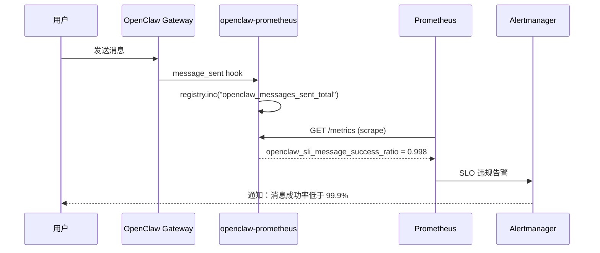

# OpenClaw-Prometheus 使用指南（安装 Prometheus + 安装 openclaw-prometheus + 集成配置）

本指南面向希望为 OpenClaw Gateway 搭建 Prometheus 监控的使用者，覆盖从 Prometheus/Grafana 部署、`openclaw-prometheus` 插件安装与配置，到联调验证与告警配置的完整路径。

> 术语速记：
> - **Scrape**：Prometheus Server 定期拉取指标端点的过程。
> - **Exporter**：暴露 Prometheus 格式指标的服务端点（本插件即是一个 Exporter）。
> - **openclaw-prometheus**：OpenClaw 的非渠道插件，通过 Plugin Hooks 实时计数 + Gateway RPC 拉取状态，以 Prometheus 标准格式导出指标。
> - **SLI**：Service Level Indicator，服务水平指标（如消息成功率、Agent 错误率）。
> - **SLO**：Service Level Objective，服务水平目标（如 99.9% 消息成功率）。

---

## 0. 总体架构与能力边界

- **实时计数**：Plugin Hooks（28 个）→ MetricsRegistry 内存计数器/直方图
- **状态拉取**：Gateway RPC（12 个 Collector）→ 采集缓存 → Prometheus text/JSON
- **SLI 衍生**：基于 Hook 计数器计算消息成功率、Agent 错误率等
- **鉴权保护**：可选 Bearer Token（环境变量优先）
- **告警规则**：由 Prometheus Alertmanager 承担，插件不内置告警评估

建议先阅读架构设计文档了解模块划分与约束：
- [OpenClaw-Prometheus-Architecture_CN.md](./OpenClaw-Prometheus-Architecture_CN.md)

---

## 1. 安装 Prometheus（监控服务端）

Prometheus 是一个开源监控系统与时间序列数据库，定期从配置的目标拉取指标、存储并支持 PromQL 查询。

### 1.1 部署方式建议

建议优先使用 Docker（便于升级与迁移）。如果你需要系统服务管理与开机自启，再使用 systemd 配合。

你也可以采用反向代理（如 Nginx）统一 TLS、域名与访问控制。

### 1.2 Docker 部署（示例）

1) 创建配置文件

```bash
mkdir -p /opt/prometheus
cat > /opt/prometheus/prometheus.yml << 'EOF'
global:
  scrape_interval: 15s
  evaluation_interval: 15s

scrape_configs:
  - job_name: 'openclaw-gateway'
    scrape_interval: 15s
    scrape_timeout: 10s
    metrics_path: /metrics
    honor_labels: true
    scheme: http
    static_configs:
      - targets: ['host.docker.internal:18789']
        labels:
          cluster: 'default'
EOF
```

2) 启动容器

```bash
docker run -d --name prometheus \
  -p 9090:9090 \
  -v /opt/prometheus/prometheus.yml:/etc/prometheus/prometheus.yml \
  -v prometheus-data:/prometheus \
  --restart unless-stopped \
  prom/prometheus:latest
```

3) 访问 Prometheus UI

浏览器打开 `http://<host>:9090`，在 Graph 页面输入 `openclaw_up` 验证数据是否正常采集。

### 1.3 二进制部署（Linux）

```bash
# 下载
wget https://github.com/prometheus/prometheus/releases/download/v2.53.0/prometheus-2.53.0.linux-amd64.tar.gz
tar xzf prometheus-*.tar.gz
cd prometheus-*/

# 使用项目自带的配置文件
cp /path/to/openclaw-prometheus/config/local-prometheus.yml prometheus.yml

# 启动
./prometheus --config.file=prometheus.yml
```

### 1.4 Nginx 反向代理（建议生产）

当你希望使用 `https://prometheus.example.com` 这种稳定入口时，建议用 Nginx 反代 Prometheus：

```nginx
upstream prometheus {
  server 127.0.0.1:9090;
}

server {
  listen 80;
  server_name prometheus.example.com;

  location / {
    proxy_pass         http://prometheus;
    proxy_http_version 1.1;
    proxy_set_header   Host $http_host;
    proxy_set_header   X-Real-IP $remote_addr;
    proxy_set_header   X-Forwarded-For $proxy_add_x_forwarded_for;
    proxy_set_header   X-Forwarded-Proto http;
    proxy_redirect     http:// $scheme://;
  }
}
```

> 生产建议把 `listen 80` 重定向到 `443`，并开启 HSTS。

### 1.5 systemd 服务化（Linux）

```ini
[Unit]
Description=Prometheus
Requires=network.target
After=network.target

[Service]
Type=simple
User=prometheus
WorkingDirectory=/opt/prometheus
ExecStart=/opt/prometheus/prometheus --config.file=/opt/prometheus/prometheus.yml
StandardOutput=append:/var/log/prometheus/prometheus.log
StandardError=append:/var/log/prometheus/prometheus-error.log
Restart=always
RestartSec=3

[Install]
WantedBy=multi-user.target
```

```bash
sudo useradd -r -s /bin/false prometheus
sudo mkdir -p /var/log/prometheus
sudo chown -R prometheus:prometheus /opt/prometheus /var/log/prometheus
sudo ln -sf /opt/prometheus/prometheus.service /etc/systemd/system/prometheus.service
sudo systemctl daemon-reload
sudo systemctl enable prometheus
sudo systemctl start prometheus
sudo systemctl status prometheus
```

---

## 2. 安装 Grafana（可视化面板）

Grafana 是一个开源的可视化与告警平台，配合 Prometheus 数据源展示 OpenClaw 的运行状态。

### 2.1 Docker 部署

```bash
docker run -d --name grafana \
  -p 3000:3000 \
  -v grafana-data:/var/lib/grafana \
  --restart unless-stopped \
  grafana/grafana:latest
```

### 2.2 配置 Prometheus 数据源

1. 访问 Grafana：`http://<host>:3000`（默认账号 admin/admin）
2. 导航：**Configuration** → **Data Sources** → **Add data source**
3. 配置：
   - **Name**：`Prometheus-OpenClaw`
   - **Type**：`Prometheus`
   - **URL**：`http://<prometheus-host>:9090`
   - **Access**：Server (Default)
4. 点击 **Save & Test**，预期结果：**Data source is working**

### 2.3 配置 Loki 数据源（可选，日志查询）

如果你部署了 Loki 收集 OpenClaw 日志，可以添加 Loki 数据源：

1. **Name**：`Loki-OpenClaw`
2. **Type**：`Loki`
3. **URL**：`http://<loki-host>:3100`

---

## 3. 安装 openclaw-prometheus（OpenClaw 监控插件）

### 3.1 安装插件

```bash
openclaw plugins install @partme.ai/openclaw-prometheus
```

### 3.2 最小配置

```json
{
  "plugins": {
    "entries": {
      "openclaw-prometheus": {
        "enabled": true,
        "config": {
          "path": "/metrics"
        }
      }
    }
  }
}
```

说明：
- **仅 Scrape 导出**：只需 `path` 配置即可工作，所有其他配置项有合理默认值；
- **默认端口**：`9090`（仅信息性，实际端口由 Gateway 决定）；
- **默认缓存**：`collectIntervalMs: 15000`（15 秒内复用采集结果）。

### 3.3 完整配置（推荐生产）

```json
{
  "plugins": {
    "entries": {
      "openclaw-prometheus": {
        "enabled": true,
        "config": {
          "path": "/metrics",
          "collectIntervalMs": 15000,
          "snapshotIntervalMs": 30000,
          "workloadWindowMs": 300000,
          "includeRuntime": true,
          "monitoredProviders": ["openai", "anthropic", "gemini"],
          "instance": "gateway-01",
          "scrapeAuth": {
            "enabled": true
          }
        }
      }
    }
  }
}
```

配置项说明：

| 配置项 | 默认值 | 说明 |
|--------|--------|------|
| `path` | `/metrics` | 指标端点路径 |
| `collectIntervalMs` | 15000 | 采集缓存 TTL（0=禁用，每次全量采集） |
| `snapshotIntervalMs` | 30000 | Provider 认证快照刷新间隔 |
| `workloadWindowMs` | 300000 | 工作负载观测窗口（5 分钟） |
| `includeRuntime` | true | 是否包含 Node.js 进程指标 |
| `monitoredProviders` | [] | 需要监控认证状态的 Provider 列表 |
| `instance` | "" | 实例标签（多实例部署时区分） |
| `scrapeAuth.enabled` | false | 是否启用 Bearer Token 鉴权 |
| `scrapeAuth.bearerToken` | - | 开发用 Token（**生产请使用环境变量**） |

### 3.4 Scrape 鉴权配置

**推荐方式**（环境变量）：

```bash
# 在 Gateway 启动环境中设置
export openclaw-prometheus_BEARER_TOKEN="your-secret-token"
```

**开发方式**（配置文件，仅限本地测试）：

```json
{
  "scrapeAuth": {
    "enabled": true,
    "bearerToken": "dev-only-token"
  }
}
```

> 环境变量优先级高于配置文件。生产环境务必使用环境变量，避免 Token 泄露。

---

## 4. 联调验证（openclaw-prometheus）

### 4.1 验证插件加载

```bash
# 检查插件是否已加载
openclaw plugins list

# 预期输出包含
# openclaw-prometheus
```

### 4.2 验证指标端点

```bash
# 直接访问指标端点
curl -s http://127.0.0.1:18789/metrics | head -30

# 预期输出
# # HELP openclaw_exporter_build_info OpenClaw Prometheus plugin build information
# # TYPE openclaw_exporter_build_info gauge
# openclaw_exporter_build_info{plugin="openclaw-prometheus",version="0.3.0"} 1
# # HELP openclaw_up Whether OpenClaw Prometheus plugin is loaded
# # TYPE openclaw_up gauge
# openclaw_up{instance="default"} 1
# # HELP openclaw_ready Whether OpenClaw Prometheus plugin runtime is initialized
# # TYPE openclaw_ready gauge
# openclaw_ready{instance="default"} 1
```

### 4.3 验证 SLI 指标

```bash
curl -s http://127.0.0.1:18789/metrics | grep 'openclaw_sli_'

# 预期输出
# openclaw_sli_message_success_ratio 1
# openclaw_sli_agent_error_ratio 0
# openclaw_sli_tool_error_ratio 0
# openclaw_sli_channel_health_ratio 1
```

### 4.4 验证 JSON 端点

```bash
# per-object JSON
curl -s http://127.0.0.1:18789/metrics/per-object | python3 -m json.tool | head -30

# health 端点
curl -s http://127.0.0.1:18789/metrics/health | python3 -m json.tool

# 预期输出
# {
#   "ok": true,
#   "healthy": true,
#   "plugin": "openclaw-prometheus",
#   "version": "0.3.0",
#   ...
# }
```

### 4.5 验证 Prometheus 数据采集

```bash
# 在 Prometheus UI 中查询
# 打开 http://<prometheus-host>:9090/graph
# 输入查询：openclaw_up
# 预期结果：返回 1
```

### 4.6 使用测试脚本

```bash
cd /path/to/openclaw-prometheus
pnpm run test:client -- http://127.0.0.1:18789/metrics

# 带 Bearer Token
openclaw-prometheus_BEARER_TOKEN=secret pnpm run test:client -- http://127.0.0.1:18789/metrics
```

---

## 5. Grafana Dashboard 导入

### 5.1 导入集群概览 Dashboard

1. 导航：**Dashboards** → **New** → **Import**
2. 上传文件：`grafana/cluster/dashboard-overview.json`
3. 配置：
   - **Name**：`OpenClaw - Cluster Overview`
   - **Folder**：`OpenClaw`
   - **数据源**：`Prometheus-OpenClaw`
4. 点击 **Import**

### 5.2 导入详细指标 Dashboard

1. 再次导航：**Dashboards** → **New** → **Import**
2. 上传文件：`grafana/cluster/dashboard-metrics.json`
3. 配置：
   - **Name**：`OpenClaw - Detailed Metrics`
   - **Folder**：`OpenClaw`
   - **数据源**：`Prometheus-OpenClaw`
4. 点击 **Import**

### 5.3 配置 Dashboard 变量

导入后，检查 `$openclaw_instance` 变量：

1. 点击 Dashboard 顶部的变量下拉框；
2. 确保查询为：`label_values(openclaw_up, instance)`；
3. 应看到至少 `default` 或你配置的 instance 值。

### 5.4 设置时间范围

- **概览 Dashboard**：Last 15 minutes
- **详细指标 Dashboard**：Last 1 hour
- **刷新间隔**：10s

---

## 6. 应用场景实战

### 6.1 Gateway 运行状态监控

**场景描述**：你需要实时了解 OpenClaw Gateway 是否在线、运行时长、快照新鲜度等基础状态。

**PromQL 查询**：

```promql
# Gateway 是否在线
openclaw_up

# 插件运行时长
openclaw_plugin_uptime_seconds

# 快照数据新鲜度（秒）
openclaw_runtime_snapshot_age_seconds

# Runtime namespace 可用性
openclaw_runtime_namespace_available
```

**Grafana 面板建议**：
- **Stat**：`openclaw_up` → 绿色(1) / 红色(0)
- **Stat**：`openclaw_plugin_uptime_seconds` → 格式化为持续时间
- **Gauge**：`openclaw_runtime_snapshot_age_seconds` → 阈值 0-30s 绿色，30-60s 黄色，>60s 红色

### 6.2 消息投递 SLO 监控

**场景描述**：你设置了 99.9% 消息投递成功率的 SLO，需要实时监控 SLI 并设置告警。

**架构示意**：



**PromQL 查询**：

```promql
# 消息投递成功率
openclaw_sli_message_success_ratio

# SLO 错误预算
1 - openclaw_sli_message_success_ratio

# Burn Rate（1 小时错误率超过 SLO 容限的倍数）
rate(openclaw_sli_message_success_ratio[1h]) / (1 - 0.999)

# 按渠道的消息发送量
rate(openclaw_messages_sent_total[5m]) by (channel)
```

**告警规则**：

```yaml
- alert: OpenClawMessageDeliverySLOViolation
  expr: openclaw_sli_message_success_ratio < 0.999
  for: 5m
  labels:
    severity: critical
  annotations:
    summary: "消息投递 SLO 违规"
    description: "当前消息投递成功率为 {{ $value }}，低于 99.9% SLO"
```

### 6.3 Agent 性能分析与优化

**场景描述**：你有多个 AI Agent 在运行，需要分析各 Agent 的延迟分布，定位慢 Agent 并优化。

**PromQL 查询**：

```promql
# P95 Agent 延迟，按 agent_id 分组
histogram_quantile(0.95,
  sum(rate(openclaw_agent_run_duration_seconds_bucket[5m])) by (le, agent_id)
)

# Top 5 最慢 Agent
topk(5,
  histogram_quantile(0.99,
    sum(rate(openclaw_agent_run_duration_seconds_bucket[5m])) by (le, agent_id)
  )
)

# Agent 错误率
rate(openclaw_agent_runs_failed_total[5m])
  / rate(openclaw_agent_runs_started_total[5m])

# Agent 运行次数排行
topk(10, sum(openclaw_agent_runs_started_total) by (agent_id))
```

**Grafana 面板建议**：
- **Time series**：P95/P99 Agent 延迟趋势（按 agent_id 分色）
- **Bar chart**：Agent 运行次数排行
- **Table**：Agent 错误率排行

### 6.4 模型 Token 消耗与成本追踪

**场景描述**：你需要实时追踪各 Provider/Model 的 Token 消耗，计算成本趋势，发现异常消耗。

**PromQL 查询**：

```promql
# Token 吞吐量（tokens/s）
rate(openclaw_model_llm_tokens_total[5m]) by (model)

# 按 Provider 的 Token 消耗
rate(openclaw_model_llm_tokens_input_total[5m]) by (provider)
+ rate(openclaw_model_llm_tokens_output_total[5m]) by (provider)

# 日成本趋势
openclaw_usage_daily_cost_usd_total

# Provider 成本占比
openclaw_usage_provider_cost_usd_total

# 按 Model 的成本
openclaw_usage_model_cost_usd_total
```

**Grafana 面板建议**：
- **Pie chart**：Provider 成本占比
- **Time series**：日成本趋势
- **Stat**：总成本（USD）
- **Table**：按 Model 的 Token 消耗与成本

### 6.5 渠道健康监控

**场景描述**：你有多个渠道（Gotify、WeCom、MQTT 等）连接到 OpenClaw，需要实时监控渠道连接状态，及时发现断连。

**PromQL 查询**：

```promql
# 渠道连接状态
openclaw_channel_linked

# 断开渠道数
sum(openclaw_channel_linked == 0)

# 渠道活跃度（秒）
time() - openclaw_channel_last_event_timestamp_seconds

# 最近入站消息距今秒数
openclaw_channel_last_inbound_age_seconds

# 渠道发送失败数
rate(openclaw_channel_failures_total[5m]) by (channel)
```

**告警规则**：

```yaml
- alert: OpenClawChannelDisconnected
  expr: openclaw_channel_linked == 0
  for: 5m
  labels:
    severity: warning
  annotations:
    summary: "渠道 {{ $labels.channel_id }} 已断开"
```

### 6.6 模型认证过期预警

**场景描述**：你的 OpenClaw 使用多个 LLM Provider 的 API Key，需要提前预警即将过期的 Key，避免服务中断。

**PromQL 查询**：

```promql
# Provider 认证状态
openclaw_model_auth_provider_status

# 剩余有效秒数
openclaw_model_auth_provider_remaining_seconds

# 即将过期（<24h）
openclaw_model_auth_provider_remaining_seconds < 86400

# 已过期/缺失
openclaw_model_auth_provider_status{status="missing"} == 1
```

**告警规则**：

```yaml
- alert: OpenClawModelAuthExpiring
  expr: openclaw_model_auth_provider_remaining_seconds < 86400
  for: 5m
  labels:
    severity: warning
  annotations:
    summary: "Provider {{ $labels.provider }} 认证即将过期"

- alert: OpenClawModelAuthMissing
  expr: openclaw_model_auth_provider_status{status="missing"} == 1
  for: 5m
  labels:
    severity: critical
  annotations:
    summary: "Provider {{ $labels.provider }} 认证缺失"
```

### 6.7 工具调用性能监控

**场景描述**：你的 Agent 使用了多种工具（搜索、代码执行、数据库查询等），需要监控工具调用的成功率和延迟。

**PromQL 查询**：

```promql
# 工具调用错误率
openclaw_sli_tool_error_ratio

# Top 10 最慢工具
topk(10,
  histogram_quantile(0.95,
    sum(rate(openclaw_tool_call_duration_seconds_bucket[5m])) by (le, tool)
  )
)

# 工具调用频率
rate(openclaw_tool_calls_total[5m]) by (tool)

# 工具调用失败数
rate(openclaw_tool_call_failures_total[5m]) by (tool)
```

### 6.8 会话生命周期监控

**场景描述**：你需要了解会话的创建/销毁频率、Token 消耗分布、压缩效果等。

**PromQL 查询**：

```promql
# 会话创建速率
rate(openclaw_sessions_started_total[5m])

# 活跃会话数
openclaw_sessions_active_estimated

# 按 Channel 的会话分布
openclaw_session_by_channel

# 平均每会话 Token 消耗
openclaw_session_tokens_avg_per_session

# 会话压缩效果
openclaw_session_compaction_last_tokens_before
- openclaw_session_compaction_last_tokens_after
```

### 6.9 多实例集群监控

**场景描述**：你部署了多个 OpenClaw Gateway 实例，需要统一监控所有实例的状态。

**配置**：

每个实例配置不同的 `instance` 标签：

```json
// 实例 1
{ "instance": "gateway-01" }

// 实例 2
{ "instance": "gateway-02" }
```

**Prometheus 抓取配置**：

```yaml
scrape_configs:
  - job_name: openclaw
    scrape_interval: 15s
    metrics_path: /metrics
    static_configs:
      - targets: ['gateway-01:18789']
        labels:
          instance: 'gateway-01'
      - targets: ['gateway-02:18789']
        labels:
          instance: 'gateway-02'
```

**PromQL 查询**：

```promql
# 各实例 Gateway 状态
openclaw_up by (instance)

# 各实例 Agent 错误率
openclaw_sli_agent_error_ratio by (instance)

# 各实例消息吞吐
sum(rate(openclaw_messages_sent_total[5m])) by (instance)
```

### 6.10 Node.js 进程监控

**场景描述**：你需要监控 OpenClaw Gateway 进程的内存、CPU、事件循环延迟等系统级指标。

**配置**：

```json
{
  "includeRuntime": true
}
```

**PromQL 查询**：

```promql
# 堆内存使用
openclaw_nodejs_heap_used_bytes

# 事件循环延迟
openclaw_nodejs_event_loop_lag_ms

# CPU 使用率
rate(openclaw_nodejs_process_cpu_user_seconds_total[5m])
+ rate(openclaw_nodejs_process_cpu_system_seconds_total[5m])

# RSS 内存
openclaw_nodejs_rss_bytes
```

---

## 7. 场景选择速查表

| 场景 | 关键指标 | 推荐面板 | 告警 |
|------|----------|----------|------|
| Gateway 状态 | `openclaw_up`, `openclaw_ready` | Stat | `openclaw_ready == 0` |
| 消息 SLO | `openclaw_sli_message_success_ratio` | Gauge + Time series | `< 0.999` |
| Agent 性能 | `openclaw_agent_run_duration_seconds` | Histogram + Time series | P95 > 300s |
| Token 消耗 | `openclaw_model_llm_tokens_*` | Time series + Pie | 日成本异常 |
| 渠道健康 | `openclaw_channel_linked` | Stat + Table | `== 0` |
| 认证过期 | `openclaw_model_auth_provider_remaining_seconds` | Stat | `< 86400` |
| 工具性能 | `openclaw_tool_call_duration_seconds` | Histogram + Table | 错误率 > 10% |
| 会话监控 | `openclaw_sessions_active_estimated` | Time series | - |
| 集群监控 | `openclaw_up by (instance)` | Stat × N | 任一实例 down |
| 进程监控 | `openclaw_nodejs_heap_used_bytes` | Time series | 内存 > 80% |

---

## 8. 告警规则配置

### 8.1 推荐告警规则

项目提供了预定义的告警规则文件 `alerts/prometheus.yml`，可直接使用：

```yaml
groups:
  - name: openclaw
    rules:
      # Gateway 宕机
      - alert: OpenClawGatewayDown
        expr: openclaw_ready == 0
        for: 2m
        labels:
          severity: critical
        annotations:
          summary: "OpenClaw Gateway 已宕机"

      # 认证即将过期（<24h）
      - alert: OpenClawModelAuthExpiring
        expr: openclaw_model_auth_provider_remaining_seconds < 86400
        for: 5m
        labels:
          severity: warning
        annotations:
          summary: "Provider {{ $labels.provider }} 认证即将过期"

      # 渠道断开
      - alert: OpenClawChannelDisconnected
        expr: openclaw_channel_linked == 0
        for: 5m
        labels:
          severity: warning
        annotations:
          summary: "渠道 {{ $labels.channel_id }} 已断开"

      # 采集器失败
      - alert: OpenClawCollectorFailing
        expr: openclaw_metrics_collector_success == 0
        for: 10m
        labels:
          severity: warning
        annotations:
          summary: "采集器 {{ $labels.collector }} 持续失败"

      # 会话成本异常
      - alert: OpenClawCostSpike
        expr: rate(openclaw_usage_cost_usd_total[1h]) > 10
        for: 30m
        labels:
          severity: warning
        annotations:
          summary: "会话成本异常升高"

      # Agent 错误率高（>10%）
      - alert: OpenClawAgentErrorRateHigh
        expr: rate(openclaw_agent_runs_failed_total[5m]) / rate(openclaw_agent_runs_started_total[5m]) > 0.1
        for: 10m
        labels:
          severity: warning
        annotations:
          summary: "Agent 错误率超过 10%"

      # SLO Burn Rate
      - alert: OpenClawSLOBurnRate
        expr: rate(openclaw_sli_agent_error_ratio[1h]) / (1 - 0.999) > 1
        for: 5m
        labels:
          severity: critical
        annotations:
          summary: "SLO Burn Rate 超标"
```

### 8.2 Alertmanager 集成

配置 Alertmanager 接收告警并通知到合适的渠道：

```yaml
# alertmanager.yml
route:
  receiver: 'openclaw-alerts'
  group_by: ['alertname', 'instance']
  group_wait: 10s
  group_interval: 5m
  repeat_interval: 4h

receivers:
  - name: 'openclaw-alerts'
    webhook_configs:
      - url: 'http://openclaw-gateway:18789/api/alerts'
    # 或使用邮件/Slack/钉钉等
```

---

## 9. Prometheus 端点速查（与插件对应关系）

### 9.1 标准 Scrape 端点

| 端点 | 格式 | 说明 |
|------|------|------|
| `GET {path}` | Prometheus text | 标准 Scrape 目标（`Content-Type: text/plain; version=0.0.4`） |
| `GET {path}/per-object` | JSON | 按对象分组，含 diagnostics |
| `GET {path}/detailed?family=` | JSON | 按名称子串过滤（减少传输量） |
| `GET {path}/health` | JSON | 插件健康状态 |
| `GET {path}/debug` | JSON | 调试信息 |

### 9.2 Gateway Method

| Method | 说明 |
|--------|------|
| `openclaw.prometheus.status` | 插件状态查询（RPC） |
| `openclaw.alertmanager.configure` | 告警规则配置（RPC） |

---

## 10. 常见问题与排查

### 10.1 Prometheus 无数据

**问题**：`curl http://127.0.0.1:18789/metrics` 返回空响应或 404

**排查步骤**：

```bash
# 1. 检查插件是否已加载
openclaw plugins list

# 2. 检查插件状态
openclaw plugins status openclaw-prometheus

# 3. 检查 Gateway 是否运行
curl -I http://127.0.0.1:18789/health

# 4. 检查 Prometheus 配置
cat /opt/prometheus/prometheus.yml | grep -A5 'static_configs'

# 5. 检查 Prometheus 日志
tail -f /var/log/prometheus/prometheus.log | grep -i 'error\|failed'
```

### 10.2 401 Unauthorized

**问题**：Scrape 返回 401

**原因**：
- 启用了 `scrapeAuth.enabled: true` 但 Prometheus 未配置 Bearer Token
- Token 不匹配

**解决方案**：
```bash
# 检查环境变量
echo $openclaw-prometheus_BEARER_TOKEN

# 检查 Prometheus 配置
cat /opt/prometheus/prometheus.yml | grep bearer

# 手动测试
curl -H "Authorization: Bearer YOUR_TOKEN" http://127.0.0.1:18789/metrics
```

### 10.3 503 Service Unavailable

**问题**：Scrape 返回 503

**原因**：
- 启用了 `scrapeAuth.enabled: true` 但未配置任何 Token（环境变量和配置文件都为空）

**解决方案**：
```bash
# 设置环境变量
export openclaw-prometheus_BEARER_TOKEN="your-secret-token"

# 或在配置中设置（仅开发环境）
# "scrapeAuth": { "enabled": true, "bearerToken": "dev-token" }
```

### 10.4 指标数据不完整

**问题**：部分指标缺失（如 `openclaw_channel_*` 不存在）

**原因**：
- 对应的 Collector RPC 调用失败
- Gateway RPC 客户端未初始化

**排查步骤**：
```bash
# 检查 Health 端点
curl -s http://127.0.0.1:18789/metrics/health | python3 -m json.tool

# 检查 Collector 状态
# "collectors": { "total": 12, "failed": N }

# 检查 RPC 状态
# "rpc": { "initialized": true/false }

# 检查 Debug 端点
curl -s http://127.0.0.1:18789/metrics/debug | python3 -m json.tool
```

### 10.5 Histogram 查询返回 NaN

**问题**：`histogram_quantile()` 返回 NaN

**原因**：
- 数据量不足（Prometheus 还未采集到足够样本）
- `_bucket` 指标不存在

**排查步骤**：
```bash
# 验证指标类型
curl -s http://127.0.0.1:18789/metrics | grep 'TYPE openclaw_agent_run_duration_seconds'

# 预期输出
# TYPE openclaw_agent_run_duration_seconds histogram

# 验证 _bucket 指标
curl -s http://127.0.0.1:18789/metrics | grep 'openclaw_agent_run_duration_seconds_bucket' | head -5

# 在 Prometheus UI 中测试
# histogram_quantile(0.95, rate(openclaw_agent_run_duration_seconds_bucket[5m]))
```

### 10.6 Grafana Dashboard 空白

**问题**：导入的 Dashboard 完全空白

**排查步骤**：
```bash
# 1. 验证数据源连接
# 在 Grafana 中：Configuration → Data Sources → Test

# 2. 验证变量查询
# 在 Grafana 中：Dashboard Settings → Variables → Query Inspector

# 3. 直接查询 Prometheus
curl -s "http://127.0.0.1:9090/api/v1/query?query=openclaw_up"

# 4. 调整时间范围
# 选择 "Last 15 minutes" 或 "Last 1 hour"
```

### 10.7 采集缓存导致数据延迟

**问题**：指标更新不及时

**原因**：
- `collectIntervalMs` 设置过大，缓存未过期

**解决方案**：
```json
{
  "collectIntervalMs": 0
}
```

> 设为 0 禁用缓存，每次 Scrape 全量采集。注意这会增加 Gateway RPC 压力。

### 10.8 Instance 标签丢失

**问题**：指标中没有 `instance` 标签

**解决方案**：

```bash
# 1. 检查插件配置
# "instance": "gateway-01"

# 2. 检查 Prometheus relabel_config
cat /opt/prometheus/prometheus.yml | grep -A10 'relabel_configs'

# 3. 验证 instance 标签
curl -s http://127.0.0.1:18789/metrics | grep 'instance="' | head -5
```

---

## 11. 性能调优建议

### 11.1 Scrape 间隔

| 场景 | 推荐 Scrape 间隔 | 推荐缓存 TTL |
|------|------------------|--------------|
| 开发/测试 | 5s | 0（禁用） |
| 生产（小规模） | 15s | 15000ms |
| 生产（大规模） | 30s | 30000ms |

### 11.2 监控 Provider 数量

`monitoredProviders` 列表中的每个 Provider 在每次快照刷新时都会调用 `resolveApiKeyForProvider()`，建议仅监控实际使用的 Provider：

```json
{
  "monitoredProviders": ["openai", "anthropic"]
}
```

### 11.3 进程指标

Node.js 进程指标（`openclaw_nodejs_*`）会增加约 9 个指标系列。如果不需要，可以关闭：

```json
{
  "includeRuntime": false
}
```

### 11.4 高基数标签控制

插件已内置高基数控制：
- Agent duration histogram 不含 `result` 标签（避免 cardinality 爆炸）；
- 使用独立的 `openclaw_agent_runs_failed_total{agent_id}` 替代；
- 渠道标签使用 `channel_id` 而非自由文本。

---

## 12. 安全注意事项

1. **Scrape 鉴权**：生产环境务必启用 `scrapeAuth.enabled: true`，使用环境变量设置 Token；
2. **TLS 终止**：指标端点的 TLS 由 Gateway 或反向代理终止，插件本身不处理 TLS；
3. **网络隔离**：建议将 Prometheus 和 OpenClaw Gateway 部署在同一内网，避免指标端点暴露到公网；
4. **Token 管理**：`scrapeAuth.bearerToken` 配置项仅用于本地开发，生产环境使用 `openclaw-prometheus_BEARER_TOKEN` 环境变量；
5. **敏感信息**：指标中不包含 API Key、用户消息内容等敏感信息。

---

## 13. 相关文档

- **架构设计文档**：[OpenClaw-Prometheus-Architecture_CN.md](./OpenClaw-Prometheus-Architecture_CN.md)
- **指标定义文档**：[../METRICS.md](../METRICS.md)
- **部署指南**：[../DEPLOYMENT.md](../DEPLOYMENT.md)
- **Grafana Dashboard**：[../grafana/README.md](../grafana/README.md)
- **Prometheus 文档**：https://prometheus.io/docs
- **Grafana 文档**：https://grafana.com/docs
- **OpenClaw 文档**：https://docs.openclaw.ai

---

**文档版本**：1.0.0  
**最后更新**：2026-05-01  
**维护者**：PartMe.AI
